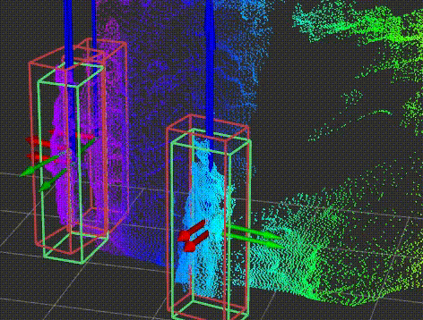

# 3D Object Detection for Pedestrian with Pointpillars, Tensorflow, Intel Realsense d435i

<p float="center">
  
</p>

# Features 
This is an implementation of the Pointpillars algorithm. It can predict a 3D bounding box on pointclouds produced by the [Intel Realsense d435i](https://www.intelrealsense.com/depth-camera-d435i/) sensor. Pleaser refer to [arXiv report](https://arxiv.org/abs/1812.05784) for further details.

This implementation:

- has the code to:
    - create and annotate your own dataset (train + eval) with the d435i,
    - train and eval on this datatset,
    - put the model into production where it fetches ROS messages from the d435i and publishes the detections to another ROS topic.
- is fully implemented in Tensorflow,
- can be converted to a tflite model to run faster on edge devices,
- is currentely unique in its ability to detect pedestians on the d435i sensor, 
- works on arbitrary videos with multiple people,
- supports both CPU and GPU inference,
- runs at 50 FPS on a 3090 RTX (so its 2x as fast as the official implementation without sacrificing precision),
- incorporates and expands many functions for pre- and post processing from the official [POINTPILLARS](https://github.com/traveller59/second.pytorch) implementation especially for data-augmentation,
- applies changes to the originally proposed architecture to better utilize the greater resultion of the d435i in comparison to the lidar scanner used in [KITTI](http://www.cvlibs.net/datasets/kitti/)
- is greatly documented and commented 

# Overview
1. Installation
1. Quickstart 
1. Create Dataset
    1. Capture Data with Annotations (can be used for training and testing)
    1. Capture Data without Annotations (can be used purely for testing, NOT training)
1. Prepare Data for Training 
    1. Create Info Files
    1. Create Ground Truth database
    1. Create Sampled Dataset for Testing 
1. Train + Evaluate Model
    1. Evaluate Model on Sampled Test Dataset (with Annotations)
    1. Evaluate Model on Test Dataset (without Annotations)
1. Visualize Results in RVIZ

# Installation

Currently, the installation of ROS Melodic, Tensorflow 2 and NVIDIA GPU drivers is obligatory:
1. Install Python 3.6.9. (Other versions of 3 may work as well)
1. Install [ROS Melodic for Python 3](https://dhanoopbhaskar.com/blog/2020-05-07-working-with-python-3-in-ros-kinetic-or-melodic/).
(Python 3 is needed for Tensoflow 2.0.)
1. Install CUDA and CUDNN drivers, if not already present.
1. Install the rest of the needed packages like tensorflow:
    - ```pip install -r configs/pip/requirements_short.txt```
4. Install additional ROS packages for RVIZ visualization:
    - ```sudo apt-get install -y ros-melodic-ros-numpy```
    - ```sudo apt-get install -y ros-melodic-jsk-visualization```
    - ```sudo apt-get install -y ros-melodic-depth-image-proc```
5. Install the d435i: [Installation here](https://github.com/IntelRealSense/librealsense/blob/master/doc/distribution_linux.md).
Or just use these commands:
    - ```sudo apt-key adv --keyserver keys.gnupg.net --recv-key F6E65AC044F831AC80A06380C8B3A55A6F3EFCDE || sudo apt-key adv --keyserver hkp://keyserver.ubuntu.com:80 --recv-key F6E65AC044F831AC80A06380C8B3A55A6F3EFCDE```
    - ```sudo add-apt-repository "deb http://realsense-hw-public.s3.amazonaws.com/Debian/apt-repo bionic main" -u```
    - ```sudo apt-get install librealsense2-dkms```
    - ```sudo apt-get install librealsense2-utils```
    - ```sudo apt-get install ros-melodic-realsense2-camera```
    - Test installation: ```realsense-viewer```
# Quickstart

If you have a Realsense d435i sensor you can simply run inference on its ROS output stream. First you need to follow the steps under [Installation](#Installation) and than run the following commands in separate terminal windows:
1. Start ROS:
    - ```roscore```
1. Start RVIZ for visualization:
    - ```rviz```
    - In RVIZ, load the config: configs/rviz/production_mode.rviz for proper visualization.
1. Start the camera and ROS stream:
    - ```roslaunch realsense2_camera rs_camera.launch filters:=pointcloud```
    - this will publish ROS messages of type "msg_PointCloud2" to the topic "/camera/depth/color/points" 
1. Start pipeline:
    - ```python train.py evaluate configs/train.yaml```
1. Now you should see the pointcloud of the sensor and 3D detections in RVIZ (like [this](#3D-Object-Detection-for-Pedestrian-with-Pointpillars,-Tensorflow,-Intel-Realsense-d435i))

# Create Datasets

It's possible to create our your dataset, if you want to train for a different type of objects. Therefore, we simply record pointclouds from the realsense sensor and save annotation files along with the pointclouds. However, to skip all the time consuming annotation work, we use a simple approach by placing the object in predefined locations with different (also predefined) rotations (in total 8 rotations, rotated by 45 degree each time and covering 360 degrees in total). This procedure can be repeated for multiple scenes to increase the variety in the training data. The following section examines this concept.


## 1. Capture Data with Annotations (for training and testing)

<p float="center">
  
</p>

```
python scripts/realsense_make_dataset.py live_mode_off DATASETPATH ROTATION START_IDX END_IDX TRAIN_OR_TEST

For example: 
python scripts/realsense_make_dataset.py live_mode_off data/ -3.14 0 150 train
```

Adjust the following params:
* For DATASETPATH, you can just use your absolute path to the "dataset" folder within this repo or wherever you want to store the dataset.

* For ROTATION you need to run this command 8 times to get data for 8 rotations. The ROTATIONS are: -3.14, -2.35, -1.57, -0.78, 2.35, 1.57, 0.78, 0.00 (also you need to change START_IDX and END_IDX for every run) 

* START_IDX and END_IDX: defines the naming of the annotations but also how many pointcloud you capture. For example: 0, 150 for rotation -3.14 and next time 150, 300 for rotation -2.35.

* TRAIN_OR_TEST is set by you to "train" or "test" depending on if you need train or test data.

In total you have to run the command 16 times (8 rotations * 2 (train & test)) to get training and test data for every rotation. 
You can repeat this procedure several times for different scenes, e.g. 2 times as shown in the illustration above. You have to place the object you want to record inside the bounding box shown in rviz during the execution of this file. Therefore you have to load the config: configs/rviz/production_mode.rviz in RVIZ.

This procedure will store data under:
* DATASETPATH/training/calib
* DATASETPATH/training/label_2
* DATASETPATH/training/velodyne
* DATASETPATH/testing/calib
* DATASETPATH/testing/label_2
* DATASETPATH/testing/velodyne

## 2. Capture Data without Annotations (purely for testing, NOT training)

<p float="center">
  
</p>
Image: Here we see your recorded dataset directly from the 435i which can be processed by the model [later on](#Evaluate-Model-on-Test-Dataset-(without-Annotations)).
<br/><br/>

In case you want to capture data from the realsense sensor without annotations use this:
```
python scripts/realsense_make_dataset.py live_mode_on DATASETPATH  
```
* change DATASETPATH accordingly 

This procedure will store data under:
* DATASETPATH/testing_live/velodyne

# 2. Prepare Data for Training
For training, your custom data needs to be prepared. The first step collects the data from all locations and accumulates them into one big to save time while training. The second step extracts all ground truth annotations from our training & test data, to be used while training % testing for data augmentation (train & test data will not be mixed, of course). In the third step, we create a simulated test dataset with the help of ground truth annotations (from step two) data augmentation. 

## 1. Create Info Files

The training needs TWO FILES (one for training and one for testing) which accumulates all information (like camera calibration and bounding box coordinates). 
We create these files with:
```
python create_data.py create_kitti_info_file DATASETPATH
```
* change DATASETPATH accordingly

This will store them here:
* DATASETPATH/kitti_infos_train.pkl
* DATASETPATH/kitti_infos_val.pkl

## 2. Create Ground Truth database

For the data augementation in training & testing we need to extract annotations and their points. 
```
python create_data.py create_groundtruth_database DATASETPATH train
python create_data.py create_groundtruth_database DATASETPATH test
```
This will store data under:
* DATASETPATH/gt_database (points are stored here)
* DATASETPATH/gt_database_val (points are stored here)
* DATASETPATH/kitti_dbinfos_train.pkl (annotations are stored here)
* DATASETPATH/kitti_dbinfos_val.pkl (annotations are stored here)

## 3. Create Sampled Dataset for Testing

<p float="center">
  
</p>
Image: This is our artifically created test dataset for quantitative evaluation [later on](#Evaluate-Model-on-Sampled-Test-Dataset-(with-Annotations)).
<br/><br/>

1. We create a test dataset with the help of data augmentation and the annotations extracted in the last section to be able to apply a quantitative evaluation later on.

    ```
    python load_data.py KITTI_INFOS_VAL_PATH KITTI_DBINFOS_VAL_PATH
    ```

    * KITTI_INFOS_VAL_PATH is the absolute path to your kitti_infos_val.pkl
    * KITTI_DBINFOS_VAL_PATH is the absolute path to your kitti_dbinfos_val.pkl 
    * Also change train_input_reader.dataset_root_path in configs/train.yaml to your DATASETPATH

    This will store data under:
    * DATASETPATH/kitti_infos_val_sampled.pkl (annotations are stored here)
    * DATASETPATH/testing/velodyne_sampled (points are stored here)

1. Rename the "velodyne" folder to "velodyne_unsampled"
1. Make a copy of the "velodyne_sampled" folder and rename the copied folder to "velodyne".
    * Now you have the folders "velodyne", "velodyne_sampled" and "velodyne_unsampled" under the folder "testing"
    * "velodyne" : contains the sampled (data augmented) test dataset 
    * "velodyne_sampled" : contains a backup of the sampled (data augmented) test dataset 
    * "velodyne_unsampled" : contains the unsampled (not data augmented) test dataset which is not used anymore

# Train + Evaluate Model

After you created your dataset or downloaded mine, you can train the model.

First, open /configs/train.yaml and change params:
- production_mode: False
- train_input_reader.img_list_and_infos_path: absolute path to kitti_infos_train.pkl
- train_input_reader.dataset_root_path: DATASETPATH
- train_input_reader.sampler_info_path: absolute path to kitti_dbinfos_train.pkl
- eval_input_reader.no_annos_mode: False
- eval_input_reader.img_list_and_infos_path: absolute path to kitti_infos_val_sampled.pkl
- eval_input_reader.dataset_root_path: DATASETPATH

Than:

```python train.py train configs/train.yaml```

- This will train the model for 160 epochs and evaluates after each one. 
- Also, the model is saved after each epoch in case you find certain epochs working better for you than others. 
- The weights and evaluation results are stored under the folder "/out"

# Evaluate Model 


## Evaluate Model on Sampled Test Dataset (with Annotations)

To evaluate the test dataset created in [Create Sampled Dataset for Testing](#3.-Create-Sampled-Dataset-for-Testing):

Open /configs/train.yaml and change the params:
- eval_model_id: is the model number you want evaluate (found in "/out")
- eval_checkpoint: is the epoch you want to evaluate (found in "/out/model_x/out_dir_checkpoints/")
- production_mode: False
- eval_input_reader.no_annos_mode: False
- eval_input_reader.img_list_and_infos_path: absolute path to kitti_infos_val_sampled.pkl
- eval_input_reader.dataset_root_path: DATASETPATH

Than: 

```python train.py evaluate configs/train.yaml```

- The evaluation output in KITTI style will look like this:


Pedestrian | Min Overlap |  AP |
--- | --- | --- 
*bev* | 0.50 | 99.10
*3d* |0.50 |  **`98.66`**
*aos* | 0.50 | 57.04

And again with higher difficulty (higher "Min Overlap"):


Pedestrian | Min Overlap | AP |
--- | --- | --- | ---
*bev* |0.75 | 98.58
*3d* | 0.55 | 88.15
*aos* | 0.55 | 56.78

Markdown | Less | Pretty
--- | --- | ---
*Still* | `renders` | **nicely**
1 | 2 | 3


<br/>

- \* Please keep in mind, that the following results are real, however, the **test dataset is in its characterictica very close to the training dataset**. That is why the evaluation is so good. (None of the test data was used while training, though. So there is **no** *Data leakage*)


- \* The current best method on the KITTI leader board for pedestrian has a 3D AP at 0.50 AP of **52.75 %**. This implementation of Pointpillars has **98.66**. The distances in comparison to KITTI are, however, much lower. 

- **AP**: Mean average precision (mAP). Average of the maximum precision at different recall values.
- **Min Overlap**: The minimum overlap of ground truth and prediction to be correct. 
- **bev**: Bird's eye view overlap (2D) of prediction and ground truth.
- **3d**: 3D overlap of prediction and ground truth.
- **aos**: Average orientation similarity of prediction and ground truth jointly with object detection.
    -  The orientation estimation is not very good since the algorithm has a hard time to differentiate between back and front of a person. That's why the prediction is often shifted by 180°.


- Predictions are stored in the "out/model_\<modelNumber>" folder 
- For visualization see [Visualize Results in RVIZ](#Visualize-Results-in-RVIZ)


## Evaluate Model on Test Dataset (without Annotations)

To evaluate the test dataset created in [Capture Data with Annotations (for training and testing)](#1.-Capture-Data-with-Annotations-(for-training-and-testing)):

Open /configs/train.yaml and change the params:
- eval_model_id: is the model number you want evaluate (found in "/out")
- eval_checkpoint: is the epoch you want to evaluate (found in "/out/model_x/out_dir_checkpoints/")
- production_mode: False
- eval_input_reader.no_annos_mode: True
- eval_input_reader.dataset_root_path: DATASETPATH

Than: 

```python train.py evaluate configs/train.yaml```

- There is no output here since we don't have annotation.
- Predictions are stored in the "out/model_\<modelNumber>" folder 
    - For visualization see [Visualize Results in RVIZ](#Visualize-Results-in-RVIZ)

# Visualize Results in RVIZ

<p float="center">
  
  
</p>

Image: Predictions in green and ground-truth in red. Left [with annotations](#Evaluate-Model-on-Sampled-Test-Dataset-(with-Annotations)) and right [without](#Evaluate-Model-on-Test-Dataset-(without-Annotations)).

If you evaluated either with or without annotations, you can show the results in RVIZ.

- To switch between the dataset with and without annotations, open "rviz_show_predictions.py" and change the "mode" variable to "live" (without annotations) or "testing_sampled" (with annotation).
    - consequently you also need to change the corresponding data paths in the according "if" statements following the "mode" parameter (so "if mode == "live":" OR "if mode == "testing_sampled":")
- Go to the /scripts folder and run following in terminal:

    ```python rviz_show_predictions.py```

- Load the configs/rviz/rviz_show_predictions.rviz in RVIZ. (visualization starts now)


